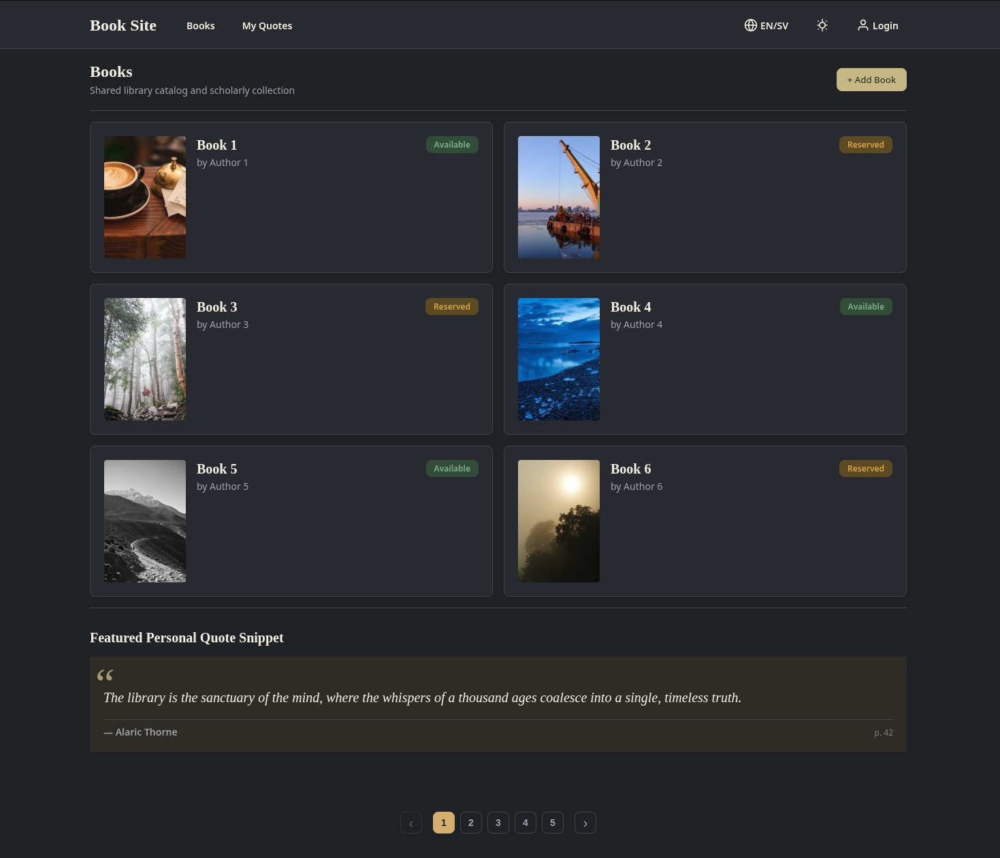

# Nordic Library Book Site


A sophisticated literary directory and personal quote manager designed with the **Nordic Nocturne** aesthetic—emphasizing high-contrast dark tones and brass accents.

> [!NOTE]
> This project is currently a frontend prototype and is not fully implemented. Key missing features include a functional login page and a live backend system.



## Table of Contents
- [Nordic Library Book Site](#nordic-library-book-site)
  - [Table of Contents](#table-of-contents)
  - [Features](#features)
    - [Global Book Directory](#global-book-directory)
    - [My Quotes](#my-quotes)
    - [Theming System](#theming-system)
    - [Mock Authentication](#mock-authentication)
    - [Placeholder Data](#placeholder-data)
  - [Getting Started](#getting-started)
    - [Project Setup](#project-setup)
    - [Working with Local AI Models](#working-with-local-ai-models)
  - [Building](#building)
  - [Testing](#testing)
    - [Unit \& Integration Tests](#unit--integration-tests)
    - [End-to-End (E2E) Tests](#end-to-end-e2e-tests)
  - [License](#license)

## Features

### Global Book Directory

A comprehensive bibliographic catalog with 15 seeded titles.
- Read-only access for guests.
- Full editing capabilities for authenticated users.
- **Pagination**: Browse books across multiple pages (6 items per page).

### My Quotes

A personal quote collection page.
- Browse saved quotes grouped by book title.
- Search quotes by keyword, author, or book.
- Placeholder data with 4 sample quotes pre-loaded.

### Theming System

- **Nordic Nocturne**: A rich dark theme using OKLCH color space.
- **Light Mode**: A high-contrast light alternative.

### Mock Authentication

A JWT-based authentication simulation via LocalStorage for rapid development.

### Placeholder Data

Seed data pre-populated for books (15 titles) and quotes (4 samples) to support development and testing.

## Getting Started

### Project Setup

1. **Clone the repository**
   ```bash
   git clone <repository-url>
   cd book-dir-webapp
   ```

2. **Install dependencies**
   ```bash
   npm install
   ```

3. **Run the development server**
   ```bash
   npm start
   ```
   Visit `http://localhost:4200` to see the app in action.

### Working with Local AI Models

This project is optimized for AI-driven development. If you are using a tool like **opencode** or other Local AI CLI agents:

1. **Initialize the Agent**: Ensure your agent has access to the root directory.
2. **Contextual Awareness**: The agent can refer to `CONTEXT.md` to understand the domain model (Books, Quotes, Users) and the visual design system (Nordic Nocturne).
3. **Engineering Skills**: This project comes pre-configured with **matt-pocock's engineering skills**, enabling agents to perform advanced tasks like codebase design, TDD, and domain modeling with higher precision.
4. **Tasks**: You can prompt the AI to:
    - *Implement new components* following the existing Angular 22 patterns.
    - *Add new features* to the Global Directory, My Quotes, or Personal Collection.
    - *Add pagination* to any listing page.
    - *Refactor themes* by updating the OKLCH color variables.

## Building

To build the project for production, use the following command:

```bash
npm run build
```

The production-ready assets will be generated in the `dist/` directory. For more information on managing the build process, refer to the [Official Angular CLI Documentation](https://angular.dev/guide/cli).

## Testing

The project uses **Vitest** for unit and integration testing.

### Unit & Integration Tests
To run the core test suite:
```bash
npm test
```

### End-to-End (E2E) Tests
For comprehensive user-flow testing, it is recommended to use tools like **Cypress** or **Playwright**. You can add E2E capabilities to this project via the Angular CLI:
```bash
ng add @cypress/schematic
```
Once configured, E2E tests can be executed to ensure the Nordic Library's critical paths (e.g., authentication and book editing) are functioning correctly.

## License

This project is licensed under the MIT License.
